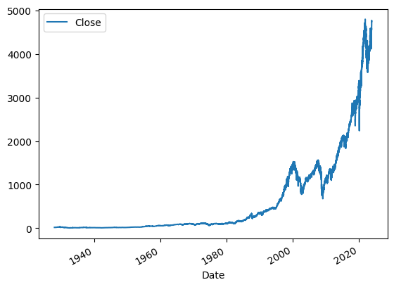

# sp500_predictor

Simple predictions of sp500 index to get familiar with time-series data and new VS Code extensions.

### SP500 historical data

 
### Next steps

Work in progress and to be developed further.

To do:

- [ ] Increase resolution
- [ ] Factor in News and use sentiment analysis
- [ ] Track industries within SP500 and check for correlation
- [ ] Extend to more indices and any correlation
